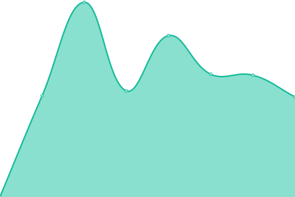
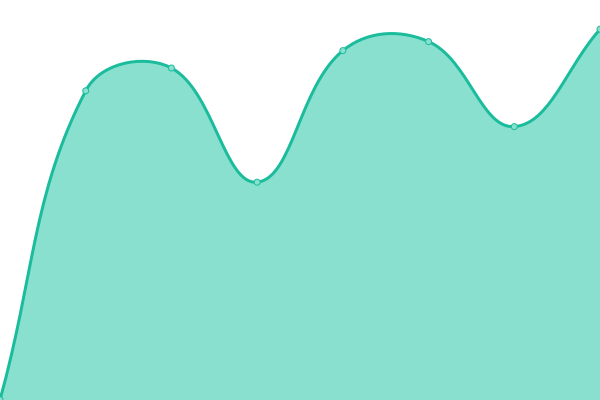
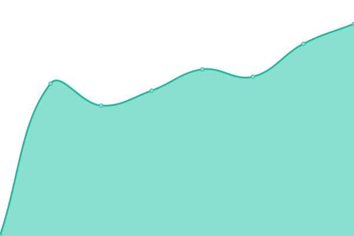

# [📈 Live Status](https://board.uwo.line.games): <!--live status--> **🟧 Partial outage**

This repository contains the open-source uptime monitor and status page for [coille02](https://www.ram-g.ml/), powered by [Upptime](https://github.com/upptime/upptime).

With [Upptime](https://upptime.js.org), you can get your own unlimited and free uptime monitor and status page, powered entirely by a GitHub repository. We use [Issues](https://github.com/coille02/Uptime/issues) as incident reports, [Actions](https://github.com/coille02/Uptime/actions) as uptime monitors, and [Pages](https://board.uwo.line.games) for the status page.

<!--start: status pages-->
<!-- This summary is generated by Upptime (https://github.com/upptime/upptime) -->
<!-- Do not edit this manually, your changes will be overwritten -->
<!-- prettier-ignore -->
| URL | Status | History | Response Time | Uptime |
| --- | ------ | ------- | ------------- | ------ |
|  [linegames Web](https://www.line.games) | 🟩 Up | [linegames-web.yml](https://github.com/coille02/upptime/commits/HEAD/history/linegames-web.yml) | 

 588ms
     
 | 

<a href="https://board.uwo.line.games/history/linegames-web">100.00%</a>
    

|  [floor](https://floor.line.games) | 🟩 Up | [floor.yml](https://github.com/coille02/upptime/commits/HEAD/history/floor.yml) | 

 1512ms
     
 | 

<a href="https://board.uwo.line.games/history/floor">100.00%</a>
    

|  [uwo sentry](https://sentry22.uwo.line.games) | 🟩 Up | [uwo-sentry.yml](https://github.com/coille02/upptime/commits/HEAD/history/uwo-sentry.yml) | 

 1178ms
     
 | 

<a href="https://board.uwo.line.games/history/uwo-sentry">100.00%</a>
    

|  [pacman](https://pacman.line.games) | 🟥 Down | [pacman.yml](https://github.com/coille02/upptime/commits/HEAD/history/pacman.yml) | 

 0ms
     
 | 

<a href="https://board.uwo.line.games/history/pacman">0.00%</a>
    

<!--end: status pages-->

[**Visit our status website →**](https://board.uwo.line.games)

## 📄 License

- Powered by: [Upptime](https://github.com/upptime/upptime)
- Code: [MIT](./LICENSE) © [coille02](https://www.ram-g.ml/)
- Data in the `./history` directory: [Open Database License](https://opendatacommons.org/licenses/odbl/1-0/)
